# Performance Analysis of Type-1 and Type-2 Hypervisors

**Proxmox VE (Type-1) vs VMware Workstation (Type-2) — CPU Benchmark using Sysbench**

---

## Table of Contents

1. [Aim](#1-aim)
2. [Objectives](#2-objectives)
3. [Theory](#3-theory)
4. [Summary](#4-summary)
5. [Architecture](#5-architecture)
6. [Repository Contents](#6-repository-contents)
7. [Requirements](#7-requirements)
8. [Standard VM Configuration](#8-standard-vm-configuration)
9. [Execution Steps — Part A: Proxmox VE (Type-1)](#9-execution-steps--part-a-proxmox-ve-type-1)
10. [Execution Steps — Part B: VMware Workstation (Type-2)](#10-execution-steps--part-b-vmware-workstation-type-2)
11. [Observations](#11-observations)
12. [Results and Graphs](#12-results-and-graphs)
13. [Evidence Screenshots](#13-evidence-screenshots)
14. [Conclusion](#14-conclusion)
15. [How to Upload to GitHub](#15-how-to-upload-to-github)

---

## 1. Aim

To compare the CPU performance of a **Type-1 hypervisor (Proxmox VE)** and a **Type-2 hypervisor (VMware Workstation)** by running an identically configured Ubuntu virtual machine and the same Sysbench CPU benchmark on both.

## 2. Objectives

- Create an Ubuntu VM on Proxmox VE (Type-1).
- Create an Ubuntu VM with the same settings on VMware Workstation (Type-2).
- Run the Sysbench CPU benchmark on both VMs.
- Record and compare total time, total events, events per second, and latency.
- Find out which hypervisor type performs better and explain why.
- Store all proof (screenshots, graphs, results) in a GitHub repository.

## 3. Theory

- A **hypervisor** is software that creates and runs virtual machines (VMs).
- **Type-1 hypervisor (bare-metal):** installed directly on the server hardware. No host OS in between. Example: Proxmox VE.
- **Type-2 hypervisor (hosted):** installed as an application on top of a host OS such as Windows. Example: VMware Workstation.
- **Sysbench** is a benchmark tool. The CPU test finds prime numbers up to a limit (20000 here). More events per second means a faster CPU.
- A Type-2 hypervisor has an extra layer (the host OS), so it is expected to have more overhead than Type-1.

## 4. Summary

- Same Ubuntu VM (2 vCPU, 2 GB RAM, 20 GB disk) was created on both hypervisors.
- Command used on both: `sysbench cpu --cpu-max-prime=20000 run`.
- **Proxmox VE:** 1,749.16 events/sec, 17,494 total events, 0.57 ms average latency.
- **VMware Workstation:** 707.43 events/sec, 7,077 total events, 1.41 ms average latency.
- **Result:** Proxmox VE (Type-1) was about **2.47x faster** than VMware Workstation (Type-2).

## 5. Architecture

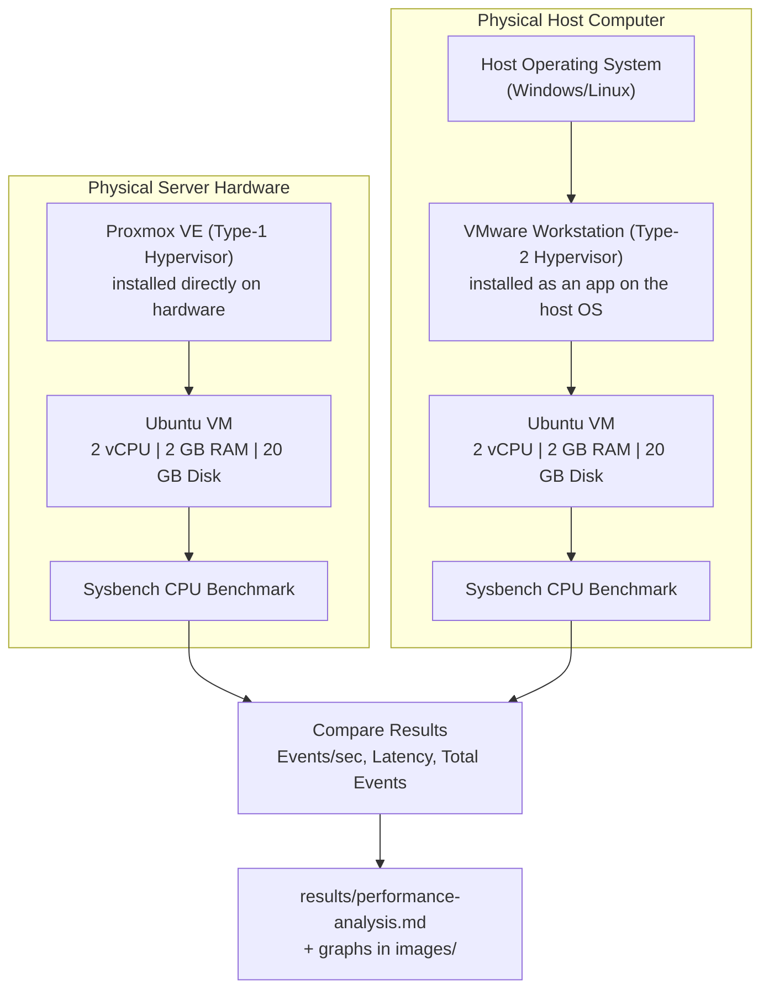

- Type-1: Hardware → Proxmox VE → Ubuntu VM → Sysbench.
- Type-2: Hardware → Host OS → VMware Workstation → Ubuntu VM → Sysbench.

## 6. Repository Contents

```
CC-Experiment-01-Hypervisor-Analysis/
├── README.md
├── .gitignore
├── images/
│   ├── events_per_second_comparison.png
│   ├── total_events_comparison.png
│   ├── latency_comparison.png
│   └── overall_performance_dashboard.png
├── results/
│   └── performance-analysis.md
└── screenshots/
    ├── type1-proxmox/
    │   ├── 01-proxmox-dashboard.png
    │   ├── 02-proxmox-vm-configuration.png
    │   ├── 03-proxmox-vm-running.png
    │   ├── 04-proxmox-ubuntu-console.png
    │   ├── 05-proxmox-system-configuration.png
    │   ├── 06-proxmox-sysbench-result.png
    │   └── 07-proxmox-resource-monitoring.png
    ├── type2-vmware/
    │   ├── 01-vmware-vm-configuration.jpeg
    │   ├── 02-vmware-vm-running.jpeg
    │   ├── 03-vmware-system-configuration.jpeg
    │   └── 04-vmware-sysbench-result.jpeg
    └── comparison/
        └── 01-hypervisor-performance-comparison.jpeg
```

| File / Folder | What it contains |
| --- | --- |
| `README.md` | This lab report: aim, steps, results, graphs, screenshots, conclusion. |
| `.gitignore` | Tells Git to ignore junk files like `.DS_Store`. |
| `images/events_per_second_comparison.png` | Bar graph of events per second for both hypervisors. |
| `images/total_events_comparison.png` | Bar graph of total events completed in the 10-second run. |
| `images/latency_comparison.png` | Bar graph of average latency for both hypervisors. |
| `images/overall_performance_dashboard.png` | All four metrics combined in one dashboard image. |
| `results/performance-analysis.md` | Full data tables, meaning of each metric, graphs, and conclusion. |
| `screenshots/type1-proxmox/` | 7 proof screenshots from Proxmox VE (dashboard, VM config, VM running, console, lscpu/free -h, Sysbench, resource graph). |
| `screenshots/type2-vmware/` | 4 proof screenshots from VMware Workstation (VM config, VM running, lscpu/free -h, Sysbench). |
| `screenshots/comparison/` | Final side-by-side comparison table screenshot. |

## 7. Requirements

| Component | Requirement |
| --- | --- |
| Type-1 Hypervisor | Proxmox VE (server IP, port 8006, login details from the lab) |
| Type-2 Hypervisor | VMware Workstation installed on your PC |
| Guest OS | Ubuntu 22.04 or later (ISO file) |
| Benchmark Tool | Sysbench |
| Browser | Google Chrome / Mozilla Firefox |
| Version Control | Git and a GitHub account |
| Free Disk Space | At least 20 GB |
| Free RAM | At least 4 GB |
| Internet | Needed to install Sysbench |

## 8. Standard VM Configuration

Both VMs must use the **same** settings for a fair comparison.

| Resource | Configuration |
| --- | --- |
| Guest OS | Ubuntu |
| CPU | 2 vCPU (1 socket × 2 cores) |
| Memory | 2 GB RAM (2048 MiB) |
| Disk | 20 GB |
| Benchmark Command | `sysbench cpu --cpu-max-prime=20000 run` |

## 9. Execution Steps — Part A: Proxmox VE (Type-1)

**A1. Log in to Proxmox VE**
1. Open a browser and go to `https://<PROXMOX_SERVER_IP>:8006`.
2. If a security warning appears, click **Advanced → Proceed**.
3. Enter username and password, click **Login**.
4. 📸 Screenshot: dashboard → `01-proxmox-dashboard.png`.

**A2. Create the VM**
1. Expand **Datacenter** and select the Proxmox node.
2. Click **Create VM** (top-right).
3. **General:** give a name, e.g. `CC-Experiment1-Type1`.
4. **OS:** choose ISO image → select the Ubuntu ISO.
5. **System:** keep defaults.
6. **Disks:** set size to **20 GB**.
7. **CPU:** Sockets **1**, Cores **2** (= 2 vCPU).
8. **Memory:** **2048 MiB**.
9. **Network:** bridge `vmbr0`, model VirtIO.
10. **Confirm:** check all settings, then click **Finish**.
11. 📸 Screenshot: Confirm page → `02-proxmox-vm-configuration.png`.

**A3. Start the VM and install Ubuntu**
1. Select the VM → click **Start**. Status changes to **Running**.
2. 📸 Screenshot: VM running → `03-proxmox-vm-running.png`.
3. Click **Console**. Ubuntu installer opens.
4. Install Ubuntu: language → keyboard → installation type → select disk → timezone → create user → finish → restart.
5. 📸 Screenshot: Ubuntu in console → `04-proxmox-ubuntu-console.png`.

**A4. Check the VM from the terminal**
1. `hostnamectl` — check OS, kernel, architecture.
2. `lscpu` — check CPU details.
3. `free -h` — check memory.
4. `df -h` — check disk.
5. `top` — check CPU/memory usage (press `q` to exit).
6. 📸 Screenshot: `lscpu` and `free -h` output → `05-proxmox-system-configuration.png`.

**A5. Install Sysbench and run the benchmark**
1. `sudo apt update`
2. `sudo apt install sysbench -y`
3. `sysbench --version`
4. `sysbench cpu --cpu-max-prime=20000 run`
5. Note: total time, total events, events per second, latency.
6. 📸 Screenshot: full output → `06-proxmox-sysbench-result.png`.

**A6. Monitor from Proxmox**
1. Go to **Datacenter → Node → VM → Summary**.
2. Check CPU, memory, network, and disk graphs.
3. 📸 Screenshot: graphs → `07-proxmox-resource-monitoring.png`.

**A7. Shut down**
1. Run `sudo poweroff` in the VM (or use **Shutdown** in Proxmox).
2. Check the status shows **Stopped**.

## 10. Execution Steps — Part B: VMware Workstation (Type-2)

**B1. Create the VM**
1. Open VMware Workstation → **Create a New Virtual Machine**.
2. Choose **Typical (recommended)** → Next.
3. Choose **Installer disc image file (iso)** → Browse → select the Ubuntu ISO → Next.
4. Guest OS: **Linux**, Version: **Ubuntu 64-bit**.
5. Name the VM, e.g. `CC-Experiment1-Type2`, and choose a location.
6. Set **Maximum disk size = 20 GB** → Next.
7. Click **Customize Hardware**:
   - Memory: **2048 MB**
   - Processors: **1 processor, 2 cores**
   - Hard Disk: confirm **20 GB**
   - Network Adapter: **NAT**
8. Click **Close** → **Finish**.
9. 📸 Screenshot: hardware settings → `01-vmware-vm-configuration.jpeg`.

**B2. Start the VM and install Ubuntu**
1. Click **Power on this virtual machine**.
2. Install Ubuntu: language → keyboard → Normal installation → Erase disk and install → timezone → create user → finish → **Restart Now**.
3. Log in.
4. 📸 Screenshot: Ubuntu running → `02-vmware-vm-running.jpeg`.

**B3. Check the VM from the terminal**
1. `hostnamectl`
2. `lscpu`
3. `free -h`
4. `df -h`
5. `top` (press `q` to exit)
6. 📸 Screenshot: `lscpu` and `free -h` → `03-vmware-system-configuration.jpeg`.

**B4. Install Sysbench and run the benchmark**
1. `sudo apt update`
2. `sudo apt install sysbench -y`
3. `sysbench --version`
4. `sysbench cpu --cpu-max-prime=20000 run`
5. Note: total time, total events, events per second, min/avg/max latency.
6. 📸 Screenshot: full output → `04-vmware-sysbench-result.jpeg`.

**B5. Shut down**
1. Run `sudo poweroff` (or **VM → Power → Shut Down Guest**).

**B6. Compare**
1. Put the results of both hypervisors in one table.
2. 📸 Screenshot: comparison table → `01-hypervisor-performance-comparison.jpeg`.

## 11. Observations

**Type-1 — Proxmox VE**

| Parameter | Observation |
| --- | --- |
| Hypervisor | Proxmox VE |
| Hypervisor Type | Type-1 |
| Guest OS | Ubuntu |
| CPU / Memory / Disk | 2 vCPU / 2 GB / 20 GB |
| Total Execution Time | 10.0005 s |
| Total Events | 17,494 |
| Events per Second | 1,749.16 |
| Average Latency | 0.57 ms |

**Type-2 — VMware Workstation**

| Parameter | Observation |
| --- | --- |
| Hypervisor | VMware Workstation |
| Hypervisor Type | Type-2 |
| Guest OS | Ubuntu |
| CPU / Memory / Disk | 2 vCPU / 2 GB / 20 GB |
| Total Execution Time | 10.0006 s |
| Total Events | 7,077 |
| Events per Second | 707.43 |
| Average Latency | 1.41 ms |

## 12. Results and Graphs

| Parameter | Type-1: Proxmox VE | Type-2: VMware Workstation |
| --- | --- | --- |
| Total Execution Time | 10.0005 s | 10.0006 s |
| Total Events | 17,494 | 7,077 |
| Events per Second | 1,749.16 | 707.43 |
| Average Latency | 0.57 ms | 1.41 ms |

**Proxmox VE is about 2.47x faster than VMware Workstation.**

**Overall Dashboard**


**Events per Second**


**Total Events**


**Average Latency**


More details: [`results/performance-analysis.md`](results/performance-analysis.md)

## 13. Evidence Screenshots

### Type-1 — Proxmox VE

**Dashboard**
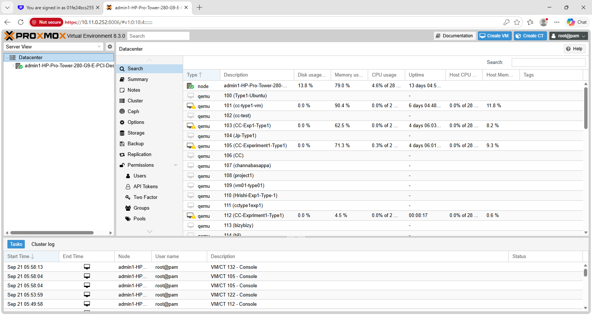

**VM Configuration**
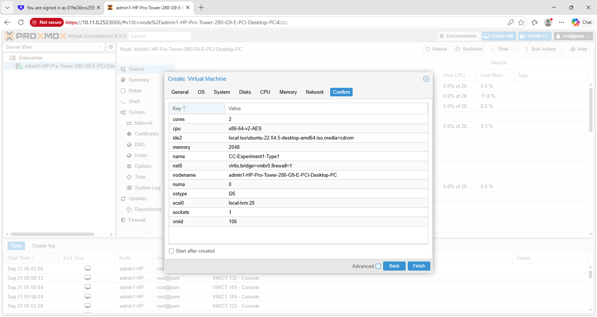

**VM Running**
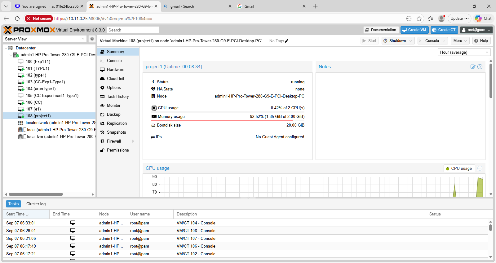

**Ubuntu Console**
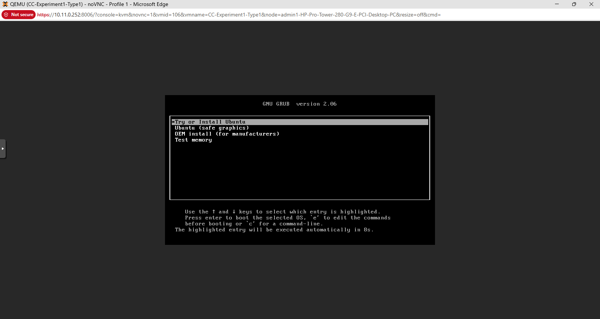

**System Configuration (lscpu / free -h)**
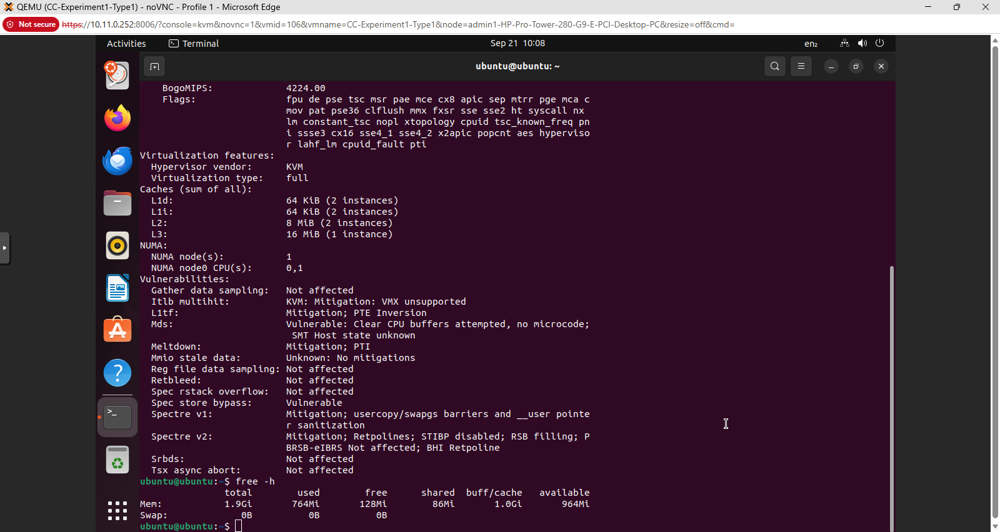

**Sysbench Result**
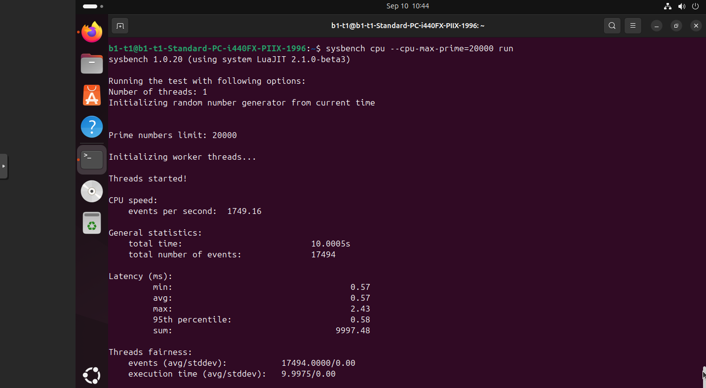

**Resource Monitoring**
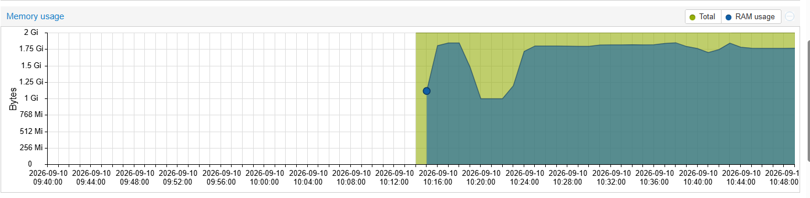

### Type-2 — VMware Workstation

**VM Configuration**
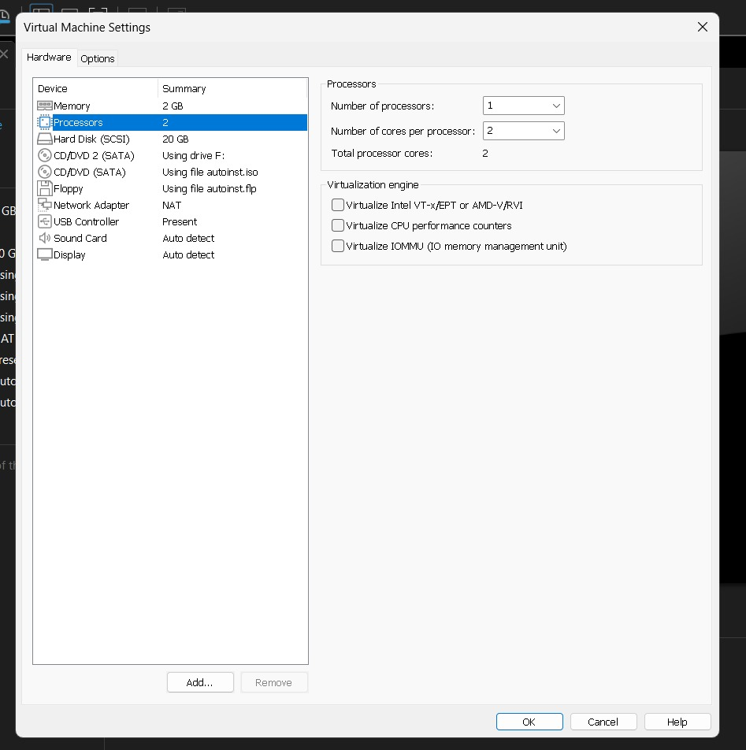

**VM Running**
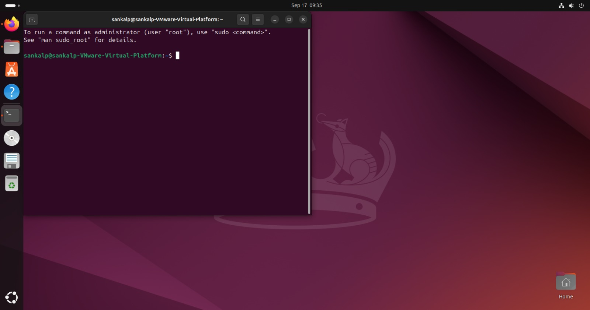

**System Configuration (lscpu / free -h)**
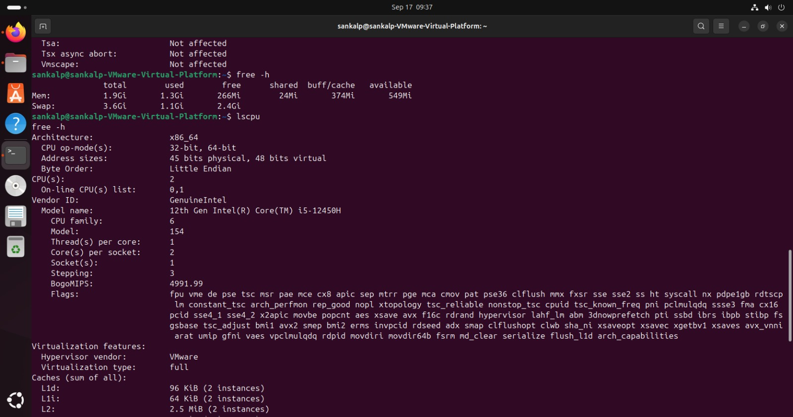

**Sysbench Result**
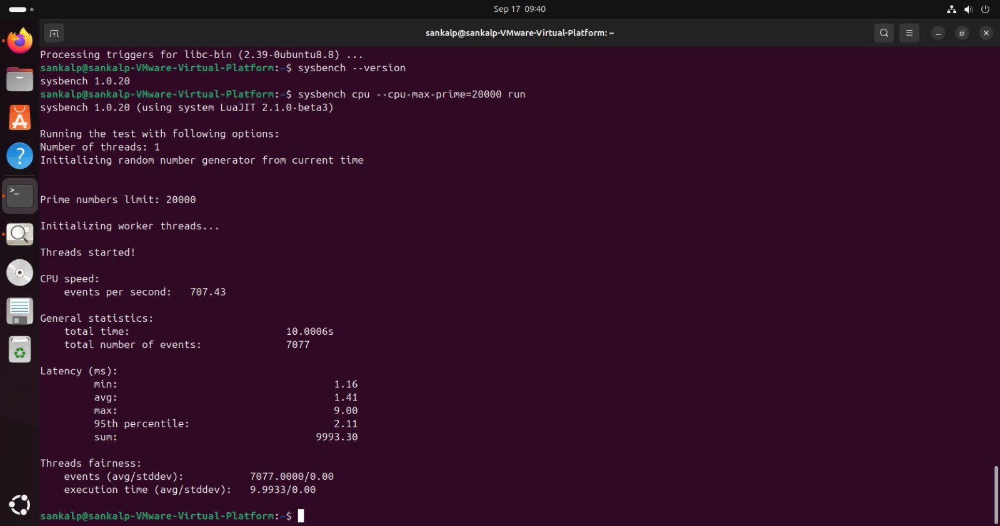

### Final Comparison

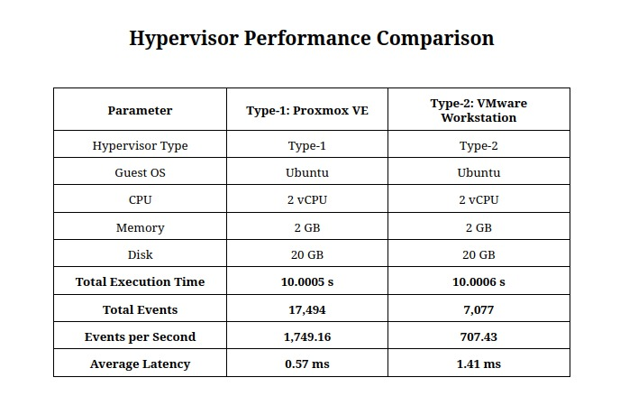

## 14. Conclusion

- Proxmox VE (Type-1) gave **1,749.16 events/sec**; VMware Workstation (Type-2) gave **707.43 events/sec**.
- Proxmox VE was about **2.47x faster** and had **lower latency** (0.57 ms vs 1.41 ms).
- Both VMs had the same settings, so the difference comes from the hypervisor type.
- Type-1 runs directly on hardware, so there is less overhead.
- Type-2 runs on top of a host OS, so there is an extra layer that slows the VM down.
- **Final answer:** for CPU-heavy work, a Type-1 hypervisor performs better than a Type-2 hypervisor.

## 15. How to Upload to GitHub

1. Go to **github.com** → click **+** → **New repository**.
2. Give it a name → click **Create repository**.
3. Click **Add file → Upload files**.
4. Drag in `README.md`, `.gitignore`, and the `images`, `results`, `screenshots` folders.
5. Click **Commit changes**.
